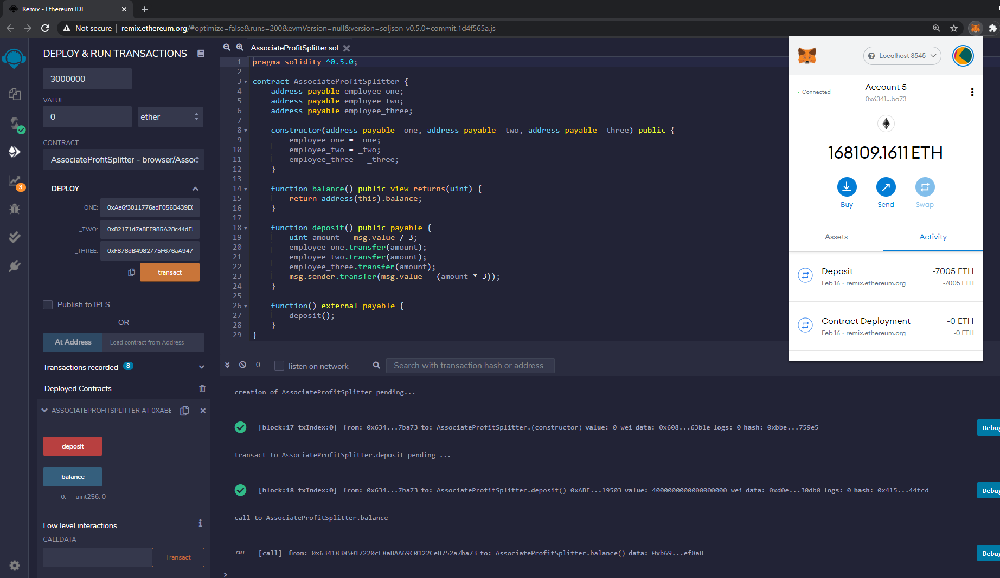
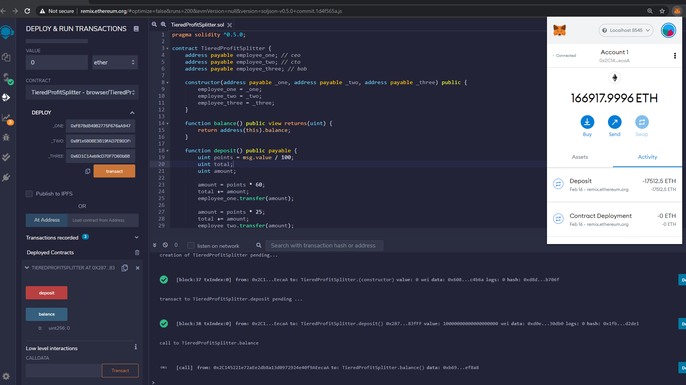
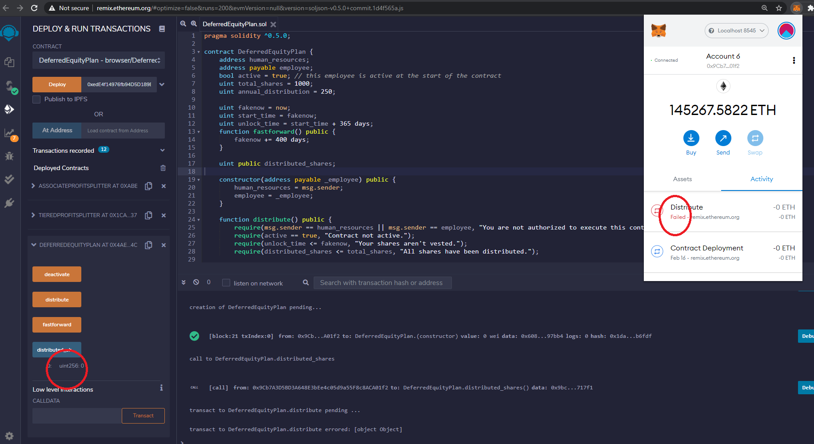
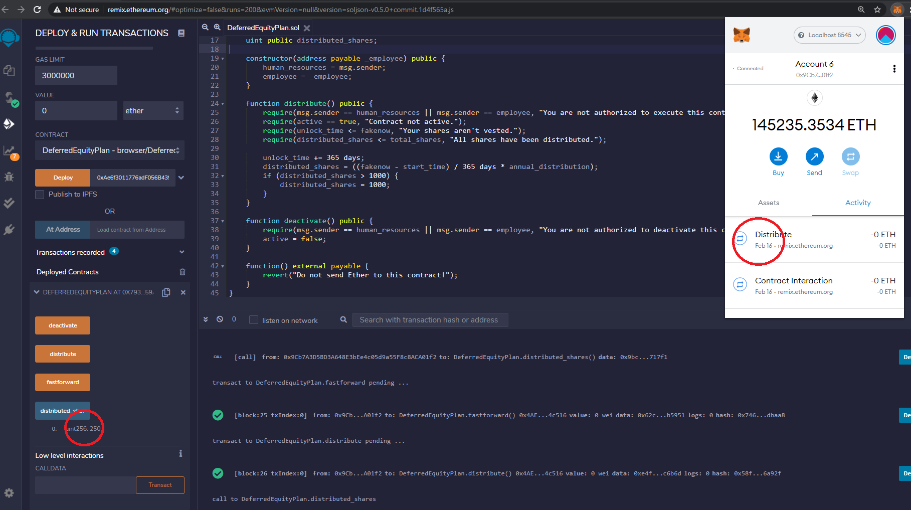

# Solidity Homework

For this homework, I've created 3 `ProfitSplitter` smart contracts. These contracts will do several things:

* Pay Associate-level employees quickly and easily

* Distribute profits to different tiers of employees

* Distribute company shares for employees in a "deferred equity incentive plan" automatically

---

## Files

* [`AssociateProfitSplitter.sol`](Code/AssociateProfitSplitter.sol)

* [`TieredProfitSplitter.sol`](Code/TieredProfitSplitter.sol)

* [`DeferredEquityPlan.sol`](Code/DeferredEquityPlan.sol)

* [`DeferredEquityPlan(fastforward_removed).sol`](Code/DeferredEquityPlan(fastforward_removed).sol)

Navigate to the [Remix IDE](https://remix.ethereum.org) and import the smart contracts. For testing, use [Ganache](https://www.trufflesuite.com/ganache) development chain, and point MetaMask to `localhost:8545`, or replace the port with what you have set in your workspace.

---

## Level One: The `AssociateProfitSplitter` Contract

Profits are divided equally among 3 employees. Since `uint` only contains positive whole numbers, and Solidity does not fully support float/decimals, we must deal with a potential remainder at the end of this function since `amount` will discard the remainder during division, thus we will transfer the remainder back to HR. I also creaed a fallback function using `function() external payable`, and call the `deposit` function from within it. This will ensure that the logic in `deposit` executes if Ether is sent directly to the contract. This is important to prevent Ether from being locked in the contract since we don't have a `withdraw` function in this use-case.

### Test the contract

In the `Deploy` tab in Remix, deploy the contract to your local Ganache chain by connecting to `Injected Web3` and ensuring MetaMask is pointed to `localhost:8545`.

You will need to fill in the constructor parameters with your designated `employee` addresses.



I tested the `deposit` function by sending 4 ethers. 


The `employee` balances show that logic is executing properly (starting balance of 100 ETH for each).


---

## Level Two: The `TieredProfitSplitter` Contract

In this contract, rather than splitting the profits between Associate-level employees, you will calculate rudimentary percentages for different tiers of employees (CEO, CTO, and Bob): CEO is 60%, CTO 25%, and Bob 15%. For any remainder, it will be sent to the CEO. 

### Test the contract

In the `Deploy` tab in Remix, deploy the contract to your local Ganache chain by connecting to `Injected Web3` and ensuring MetaMask is pointed to `localhost:8545`.

You will need to fill in the constructor parameters with your designated `employee` addresses.



I tested the `deposit` function by sending 10 ethers. 


The `employee` balances show that logic is executing properly (starting balance of 100 ETH for each: CEO gets profit sharig of 6 ETH, CTO 2.5 ETH, Bob 1.5 ETH).


---

## Level Three: The `DeferredEquityPlan` Contract

In this contract, we will be managing an employee's "deferred equity incentive plan" in which 1000 shares will be distributed over 4 years to the employee. We won't need to work with Ether in this contract, but we will be storing and setting amounts that represent the number of distributed shares the employee owns and enforcing the vetting periods automatically. I also created a `deactivate` function so HR and the employee can deactivate this contract at-will.

### Test the contract
For this contract, test the timelock functionality by adding a new variable called `uint fakenow = now;` as the first line of the contract, then replace every other instance of `now` with `fakenow`.

  * Add this function to "fast forward" time by 400 days when the contract is deployed (requires setting up `fakenow`):

    ```solidity
    function fastforward() public {
        fakenow += 400 days;
    }
    ```
Before we call the `fastforward` function, I cannot distribute any shares.




After calling `fastforward` function once (fast forwad 400 days), 250 shares are disbuted. You can see the balance of distributed shares have been updated to 250. 

